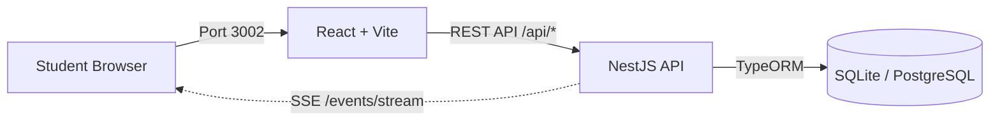

# CyberHack CTF Platform 🚩

> A high-performance, fully Dockerized CTF platform designed for offline events, workshops, and competitions.

## 🚀 Overview

CyberHack is a complete Capture The Flag hosting solution. The entire stack — Database, API, and Frontend — runs locally through Docker with a single command. The project is split into a **React + TypeScript frontend** and a **NestJS backend**, communicating over REST and Server-Sent Events (SSE).

### Key Features
- **Dockerized Architecture**: One-click deployment for DB, Backend, and Frontend.
- **NestJS Backend**: High-performance REST API with JWT authentication.
- **Real-time Updates**: Live scoreboard and activity feed via Server-Sent Events (SSE).
- **Admin Dashboard**: Full control over challenges, user accounts, and solves.
- **Persistent Database**: SQLite (local) / PostgreSQL (Docker) with TypeORM.
- **Pre-Seeded Content**: Comes pre-loaded with challenges across Easy, Medium, and Hard difficulty tiers.

---

## 🛠️ Tech Stack

### 🖥️ Frontend

| Technology | Version | Purpose |
|:---|:---|:---|
| **React** | ^18.2.0 | Core UI framework |
| **TypeScript** | ^5.2.2 | Static typing |
| **Vite** | ^5.0.8 | Build tool & dev server (Port 3002) |
| **React Router DOM** | ^7.13.0 | Client-side routing (SPA) |
| **Framer Motion** | ^11.0.3 | Animations & transitions |
| **Lucide React** | ^0.316.0 | Icon library |
| **TailwindCSS** | ^3.4.1 | Utility-first CSS styling |
| **PostCSS + Autoprefixer** | ^10.4.17 | CSS processing |

#### Frontend Structure

```
/                        # Root (Vite project)
├── App.tsx              # Root component, routing setup
├── index.tsx            # React entry point
├── constants.ts         # Global constants & config
├── types.ts             # Shared TypeScript types
├── enhanced-styles.css  # Custom global styles
│
├── pages/               # Full-page view components
│   ├── Home.tsx         # Landing / event home page
│   ├── Auth.tsx         # Login & signup page
│   ├── Challenges.tsx   # Challenge browser (Easy/Medium/Hard)
│   ├── ChallengeDetail.tsx  # Individual challenge solver
│   ├── Leaderboard.tsx  # Live scoreboard
│   ├── Admin.tsx        # Admin dashboard (challenges, users, solves)
│   ├── Files.tsx        # Public file downloads
│   ├── NotFound.tsx     # 404 page
│   └── ServerError.tsx  # 500/error page
│
├── components/          # Reusable UI components
│   ├── Navbar.tsx           # Navigation bar (auth state aware)
│   ├── WelcomeScreen.tsx    # Boot/welcome animation
│   ├── BootSequence.tsx     # Terminal boot animation
│   ├── MatrixBackground.tsx # Animated matrix rain effect
│   ├── CursorEffect.tsx     # Custom cursor FX
│   ├── Terminal.tsx         # In-page terminal emulator
│   ├── RealtimeLeaderboard.tsx   # SSE-powered leaderboard widget
│   ├── RealtimeNotifications.tsx # Live solve notifications
│   ├── ActivityFeed.tsx     # Live activity stream
│   ├── OnlineUsers.tsx      # Live online user count
│   ├── EventCountdown.tsx   # Event timer/countdown
│   ├── ProfileModal.tsx     # User profile popup
│   ├── ErrorBoundary.tsx    # React error boundary
│   ├── Portal.tsx           # React portal helper
│   └── ui/                  # Primitive UI components
│       ├── Button.tsx
│       ├── Card.tsx
│       ├── Input.tsx
│       ├── Toast.tsx
│       ├── GlitchText.tsx
│       ├── TypewriterText.tsx
│       ├── LoadingSpinner.tsx
│       └── Skeleton.tsx
│
└── services/            # API & real-time clients
    ├── api.ts           # Axios-style REST API wrapper
    ├── db.ts            # Data access helpers
    └── realtime.ts      # SSE (EventSource) connection manager
```

---

### ⚙️ Backend

| Technology | Version | Purpose |
|:---|:---|:---|
| **NestJS** | ^11.0.1 | Core framework (modular, decorator-based) |
| **TypeScript** | ^5.7.3 | Static typing |
| **TypeORM** | ^0.3.28 | ORM for database entities & queries |
| **SQLite (better-sqlite3)** | ^12.6.2 | Local development database |
| **PostgreSQL (pg)** | ^8.18.0 | Production database (Docker) |
| **JWT (@nestjs/jwt)** | ^11.0.2 | JSON Web Token auth |
| **Passport + passport-jwt** | ^0.7.0 | Auth strategy middleware |
| **bcrypt** | ^6.0.0 | Password hashing |
| **Helmet** | ^8.1.0 | HTTP security headers |
| **@nestjs/throttler** | ^6.5.0 | Rate limiting (60 req/min/IP) |
| **class-validator** | ^0.14.3 | DTO validation |
| **class-transformer** | ^0.5.1 | Data transformation |
| **RxJS** | ^7.8.1 | Reactive streams (used for SSE) |
| **ioredis** | ^5.9.3 | Redis client (caching layer) |
| **uuid** | ^13.0.0 | Unique ID generation |

#### Backend Structure

```
backend/src/
├── main.ts              # Bootstrap: CORS, Helmet, ValidationPipe, port
├── app.module.ts        # Root module, imports all feature modules
├── data-source.ts       # TypeORM DataSource config (migrations)
│
├── auth/                # Authentication module
│   ├── auth.module.ts
│   ├── auth.controller.ts   # POST /auth/login, POST /auth/signup
│   ├── auth.service.ts      # Business logic, JWT signing
│   ├── jwt.strategy.ts      # Passport JWT strategy
│   └── jwt-auth.guard.ts    # Auth guard decorator
│
├── challenges/          # Challenge module
│   ├── challenges.module.ts
│   ├── challenges.controller.ts  # GET /challenges, POST /challenges/:id/submit
│   └── challenges.service.ts     # Flag checking, solve recording
│
├── users/               # User management module
│   ├── users.module.ts
│   ├── users.controller.ts  # GET /users/me, profile endpoints
│   └── users.service.ts
│
├── leaderboard/         # Leaderboard module
│   ├── leaderboard.module.ts
│   ├── leaderboard.controller.ts  # GET /leaderboard
│   └── leaderboard.service.ts
│
├── activity/            # Activity feed module
│   ├── activity.module.ts
│   ├── activity.controller.ts  # GET /activity
│   └── activity.service.ts
│
├── events/              # SSE (Server-Sent Events) module
│   ├── events.module.ts
│   ├── events.controller.ts  # GET /events/stream
│   └── events.service.ts     # Broadcast events to connected clients
│
├── admin/               # Admin-only module
│   ├── admin.module.ts
│   ├── admin.controller.ts  # CRUD for challenges, users, resets
│   └── admin.service.ts
│
├── database/            # Database setup & seeding
│   └── (entities, seed scripts, migration files)
│
└── common/              # Shared utilities
    └── cache.module.ts  # Redis/in-memory cache module
```

#### API Endpoints (Summary)

| Method | Endpoint | Auth | Description |
|:---|:---|:---|:---|
| POST | `/auth/login` | ❌ | Login, returns JWT |
| POST | `/auth/signup` | ❌ | Register new user |
| GET | `/challenges` | ✅ | List all challenges |
| POST | `/challenges/:id/submit` | ✅ | Submit a flag |
| GET | `/leaderboard` | ✅ | Live scoreboard data |
| GET | `/activity` | ✅ | Recent solve activity |
| GET | `/events/stream` | ✅ | SSE real-time event stream |
| GET | `/users/me` | ✅ | Get current user profile |
| * | `/admin/*` | ✅ Admin | Admin-only CRUD operations |

---

## 📂 Full Project Structure

```
cyberhack-ctf-platform/
├── backend/             # NestJS API (TypeORM + SQLite/PostgreSQL)
├── components/          # React UI components
├── pages/               # Frontend page views
├── services/            # API & SSE client services
├── utils/               # Frontend utility functions
├── public/              # Static files (challenge files, etc.)
├── App.tsx              # React root with routing
├── constants.ts         # App-wide constants
├── types.ts             # Shared TypeScript types
├── vite.config.ts       # Vite dev server & proxy config
├── tsconfig.json        # Frontend TypeScript config
├── start-local.bat      # Windows local dev launcher
└── README.md            # This file
```

---

## 🚀 Quick Start

### Prerequisites

1. **Node.js**: v18 or higher
2. **Docker Desktop**: [Download here](https://www.docker.com/products/docker-desktop)

### ⚡ Docker Deployment (Recommended)

```bash
# 1. Clone the repository
git clone https://github.com/your-repo/cyberhack-ctf-platform.git
cd cyberhack-ctf-platform

# 2. Start everything
docker-compose up -d --build

# 3. Access the platform
#    Frontend: http://localhost:3002
#    Backend API: http://localhost:3001
```

> [!TIP]
> Use `docker-compose logs -f` to monitor startup and confirm database seeding is complete.

### 💻 Local Development (Without Docker)

```bash
# Terminal 1: Start the backend
cd backend
npm install
npm run start:dev       # Runs on http://localhost:3001

# Terminal 2: Start the frontend
cd ..
npm install
npm run dev             # Runs on http://localhost:3002
```

Or use the provided Windows batch script:

```bat
start-local.bat
```

---

## 🔑 Default Credentials

| Role | Username | Password |
|:---|:---|:---|
| **Admin** | `admin@ctf.net` | `admin` |

---

## 🔧 Technical Architecture



**Port Map:**

| Service | Port | Description |
|:---|:---|:---|
| Frontend (Vite / Nginx) | `3002` | React SPA |
| Backend (NestJS) | `3001` | REST API + SSE |
| PostgreSQL (Docker) | `5433` | Persistent DB |

---

## 🛠️ Developer Commands

### Frontend

```bash
npm run dev          # Start dev server (localhost:3002)
npm run host         # Dev server accessible on LAN
npm run build        # Production build
npm run preview      # Preview production build
```

### Backend

```bash
npm run start:dev    # Watch mode development
npm run start:prod   # Production start
npm run build        # Compile TypeScript
npm run test         # Run unit tests
npm run test:e2e     # Run end-to-end tests
npm run lint         # Lint & auto-fix
```

### Docker

```bash
docker-compose up -d          # Start all services (detached)
docker-compose up -d --build  # Rebuild and start
docker-compose down           # Stop all services
docker-compose logs -f        # Follow logs
```

---

## 🆘 Troubleshooting

**Database Connection Issue?**
- Docker runs PostgreSQL on port **5433**. Ensure nothing else is on that port.

**Login Fails?**
- Ensure the backend container is running (`docker ps`).
- For fresh installs, use `admin@ctf.net` / `admin`.

**Containers Not Building?**
- Ensure Docker Desktop is running and you have sufficient disk space.
- Try `docker system prune` to clear the build cache.

**Frontend Not Connecting to Backend?**
- In local dev, Vite proxies `/api` → `http://localhost:3001`. Ensure the backend is running first.
- Check your `.env.local` for correct `VITE_API_URL` values.
